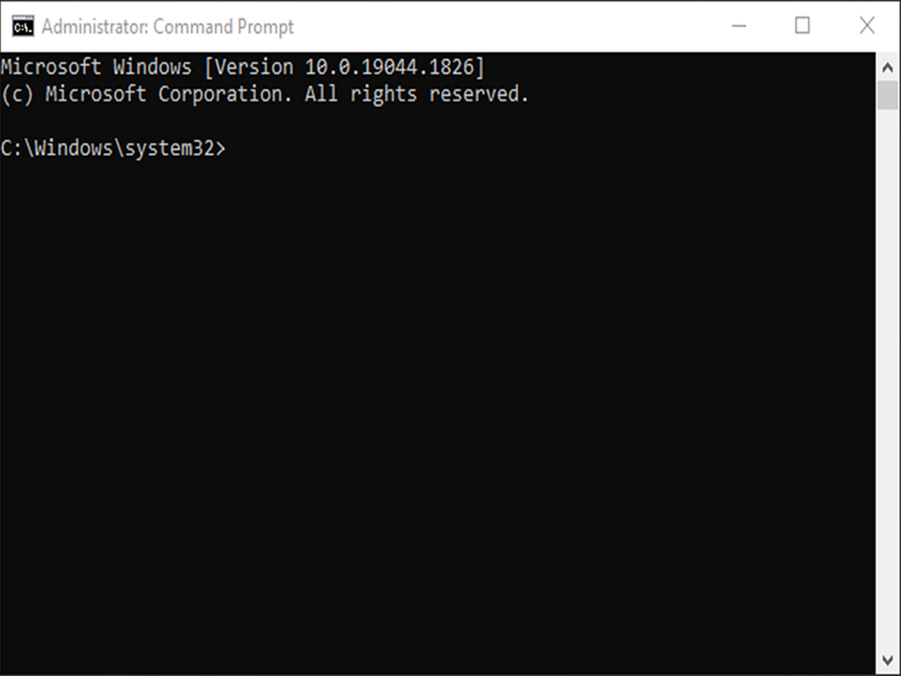
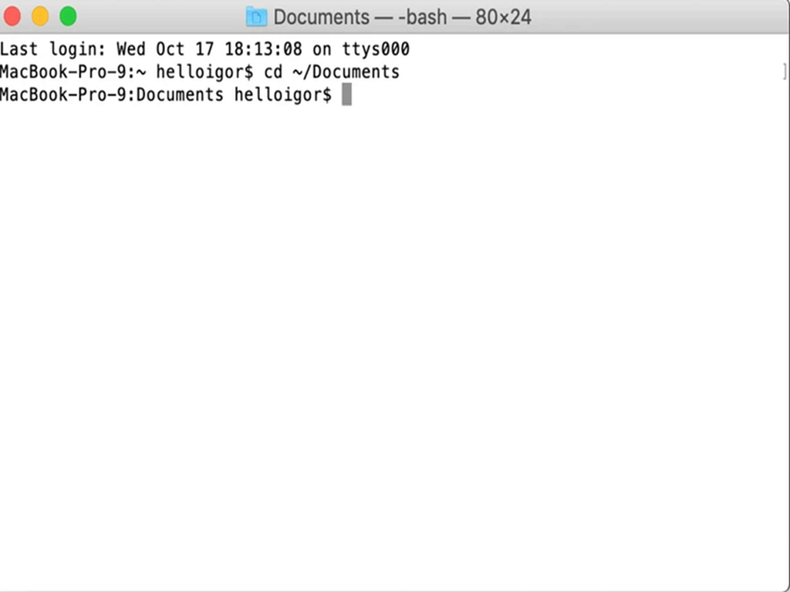
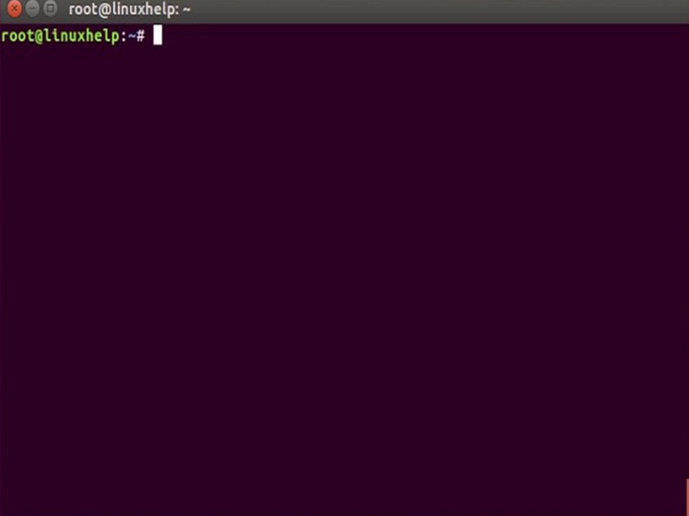

# Prerequisites

To follow along with this workshop you will need to have certain software packages installed on your computer.
On this page, you can find which software packages you need to install, external links to the official websites of the software packages and instructions on how to install them.

## OS Specific Instructions

This guide makes use of "admonitions" to provide additional information for specific operating systems. 

Give the following example admonition a try to see how it works: 

!!! Failure ""
    === ":simple-windows:"

        This is a note for Windows users.

    === ":simple-apple:"

        This is a note for Mac users.
    
    === ":simple-linux:"

        This is a note for Linux users.


**Before you begin, you should make sure that you have access to all the following software packages:**

## A Web Browser

A web browser (e.g. [Chrome](https://www.google.com/chrome/), [Firefox](https://www.mozilla.org/en-US/firefox/new/), [Safari](https://www.apple.com/safari/), [Edge](https://www.microsoft.com/en-us/edge?exp=e511&form=MA13FJ)) is necessary to follow along with this tutorial, as well as access Github.

## A Command Line Interface

To complete this tutorial, you will need access to a terminal window, any application that allows you to type commands and see the results of those commands. These kinds of applications already come pre-installed on Mac, Windows, and Linux.

### How To Check If You Have A Command Line Interface

!!! Failure ""
    === ":simple-windows:"

        The Windows console is called the **Command Prompt**, also named **cmd**.

        [Open Command Prompt on Windows](https://www.lifewire.com/how-to-open-command-prompt-2618089) by selecting the Start button, typing `cmd` in the search box, and selecting the "Command Prompt" application.

        <figure markdown>
            { width="400" .card}
            <figcaption>You should see something like this</figcaption>
        </figure>


    === ":simple-apple:"
        
        OS X’s standard console is a program called **Terminal**.

        [To open Terminal on Mac](https://support.apple.com/en-gb/guide/terminal/apd5265185d-f365-44cb-8b09-71a064a42125/mac) by pressing the `Command` key and the space bar at the same time. Then, type "terminal" in the search box and select `terminal.app`.

        <figure markdown>
            { width="400" .card}
            <figcaption>You should see something like this</figcaption>
        </figure>

    === ":simple-linux:"

        Different Linux distributions (e.g Ubuntu, Fedora, Mint) may have different console programs, usually referred to as a terminal. The exact terminal you start up, and how, can depend on your distribution. On Ubuntu, you will likely want to open **Gnome Terminal**. 

        [To open Gnome Terminal on Ubuntu](https://itsfoss.com/open-terminal-ubuntu/) you can open a terminal window by pressing the `Windows` key (also known as the super key). Then, type "terminal" in the search box and select `Terminal`.


        <figure markdown>
            { width="400" .card}
            <figcaption>You should see something like this</figcaption>
        </figure>

## Text Editor

A text editor is a program that you can use to create and edit text files. It is a very important tool for developers because it allows you to write code and view the results of your work.

There are many different text editors available for Windows, Mac, and Linux. Some of the most popular ones include:

* [Visual Studio Code](https://code.visualstudio.com/)
* [Atom](https://atom.io/)
* [Sublime Text](https://www.sublimetext.com/)
* [Notepad++](https://notepad-plus-plus.org/)
  
To install a text editor, follow the instructions on the official website of the text editor that you want to use.

**Visual Studio Code** is a good choice for beginners.

## Python 3

**Python 3.6 or later** is required to follow along with this tutorial, the latest official installation can be found [here](https://www.python.org/downloads/).

Two useful resources for installing Python 3 on Windows, Mac, and Linux are:

* [Python for Beginners: Getting Started](https://opentechschool.github.io/python-beginners/en/getting_started.html#what-is-python-exactly).
* [Python 3 Installation & Setup Guide](https://realpython.com/installing-python/)

### Checking Your Python Version

If you're not sure which version of python you have installed, you can check by running one of the following in your terminal:

!!! Failure ""
    === ":simple-windows:"

        ```powershell
        py --version
        ```

    === ":simple-apple:"

        ```bash
        python3 --version
        ```

    === ":simple-linux:"

        ```bash
        python3 --version
        ```

This should return something like this:

!!! warning ""

    ```
    Python 3.10.10
    ```

## Pip

**Pip** is a package manager for Python, it allows you to install and manage additional packages that are not part of the Python standard library.

If you don't have pip installed, we can install it as follows ([original source](https://pip.pypa.io/en/stable/installation/)):

**Copied from the source** above:**

!!! Failure ""
    === ":simple-windows:"

        ```powershell
         py -m ensurepip --upgrade
        ```

    === ":simple-apple:"

        ```bash
        python -m ensurepip --upgrade
        ```
    
    === ":simple-linux:"

        ```bash
        python -m ensurepip --upgrade
        ```


### Checking Your Pip Version

If you're not sure which version of pip you have installed, you can check by running one of the following in your terminal:

!!! Failure ""
    === ":simple-windows:"

        ```powershell
        py -m pip --version
        ```

    === ":simple-apple:"

        ```bash
        python3 -m pip --version
        ```

    === ":simple-linux:"

        ```bash
        python3 -m pip --version
        ```

This should return something like this:


!!! warning ""

    ```
    pip 23.0 from /opt/homebrew/lib/python3.10/site-packages/pip (python 3.10)
    ```


## (Optional) Python Environment

If you are new to Python, you may want to consider using a Python environment. A Python environment is a tool that helps you manage different versions of Python and Python packages. Using a virtual environment is always a good idea, and is suggested for this tutorial.

There are many different Python environments available, some of the most popular ones include:

* [Virtualenv](https://virtualenv.pypa.io/en/latest/)
* [Pipenv](https://pipenv.pypa.io/en/latest/)

Other more advanced alternatives are:

* [Poetry](https://python-poetry.org/)
* [PDM](https://pdm.fming.dev/)

Alternatively, any Anaconda variant is also a good choice:

* [Anaconda](https://www.anaconda.com/)
* [Miniconda](https://docs.conda.io/en/latest/miniconda.html)
* [Miniforge](https://github.com/conda-forge/miniforge)


If this topic is confusing or overwhelming, stick to the easiest option, which is **virtualenv**. 
Alternatively, if you have Anaconda already installed, you can use that.

### Virtualenv

**Virtualenv** is a tool to create isolated Python environments. Virtualenv creates a folder that contains all the necessary executables to use the packages that a Python project would need.

Virtualenv can be installed and used in this manner: ([source](https://packaging.python.org/en/latest/guides/installing-using-pip-and-virtual-environments/)):

!!! Failure ""
    === ":simple-windows:"

        #### Install Virtualenv

        To install virtualenv, run the following in your terminal:

        ```powershell
        py -m pip install --user virtualenv
        ```

        #### Create a Virtual Environment

        To create a new virtual environment, run the following in your terminal:

        ```powershell
        py -m venv env
        ```
        
        #### Activating a Virtual Environment

        To activate the virtual environment, run the following in your terminal:

        ```powershell
        .\env\Scripts\activate
        ```

        #### Confirm The Virtual Environment is Active

        Confirm that you are using the virtual environment by running the following in your terminal:

        ```powershell
        where python
        ```

        Which should return something like this:

        ```powershell
        ...\env\Scripts\python.exe
        ```
        

    === ":simple-apple:"

        #### Install Virtualenv

        To install virtualenv, run the following in your terminal:

        ```bash
        python3 -m pip install --user virtualenv
        ```
        
        #### Create a Virtual Environment

        To create a new virtual environment, run the following in your terminal:

        ```bash
        python3 -m venv env
        ```

        #### Activating a Virtual Environment

        To activate the virtual environment, run the following in your terminal:

        ```bash
        source env/bin/activate
        ```

        #### Confirm The Virtual Environment is Active

        Confirm that you are using the virtual environment by running the following in your terminal:

        ```zsh
        which python
        ```

        Which should return something like this:

        ```bash
        .../env/bin/python
        ```

    === ":simple-linux:"
        #### Install Virtualenv

        To install virtualenv, run the following in your terminal:

        ```bash
        python3 -m pip install --user virtualenv
        ```

        #### Create a Virtual Environment

        To create a new virtual environment, run the following in your terminal:

        ```bash
        python3 -m venv env
        ```

        #### Activating a Virtual Environment

        To activate the virtual environment, run the following in your terminal:

        ```bash
        source env/bin/activate
        ```

        #### Confirm The Virtual Environment is Active

        Confirm that you are using the virtual environment by running the following in your terminal:


        ```bash
        which python
        ```
        
        Which should return something like this:

        ```bash
        .../env/bin/python
        ```


Congratulations, you have created a virtual environment! :wink:

To deactivate the virtual environment, run the following in your terminal:

!!! warning ""
    ```bash
    deactivate
    ```

### Anaconda Environment

If you have Anaconda installed, you can create, activate, and deactivate environments using the following commands:

!!! warning ""

    === "Create a New Environment"

        To create a new environment, run the following in your terminal:

        ```
        conda create -n git-tutorial python=3.8
        ```

    === "Activate the Environment"

        To activate the environment, run the following in your terminal:

        ```
        conda activate git-tutorial
        ```

    === "Deactivate The Environment is Active"
        
        To deactivate the environment, run the following in your terminal:


        ```
        conda deactivate
        ```

<center>
## You Have Everything You Need! :tada:

[You can now move to the next session](stage_1.md)
</center>

<!-- 

!!! Failure ""
    === ":simple-windows:"

        ```powershell
        ```

    === ":simple-apple:"

        ```bash
        ```
    
    === ":simple-linux:"

        ```bash
        ```

-->