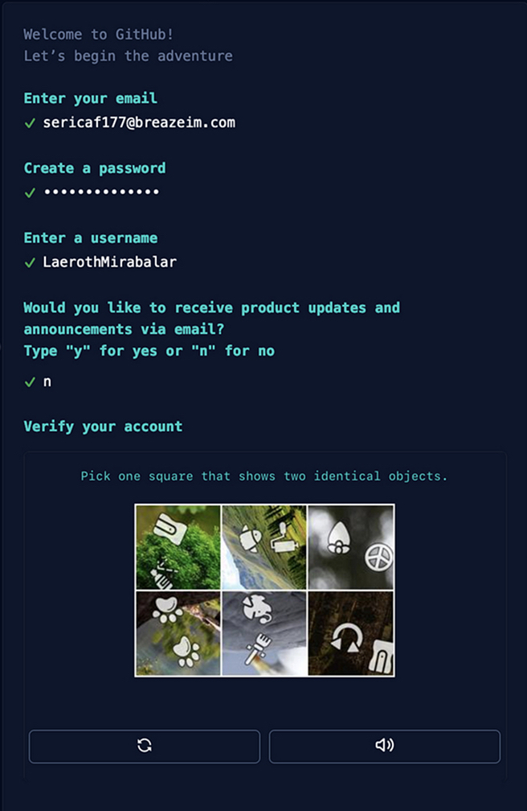
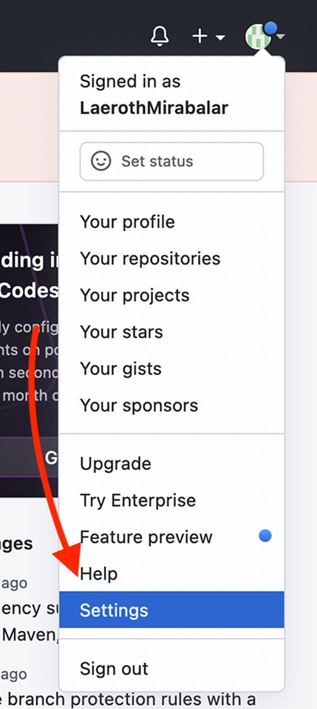
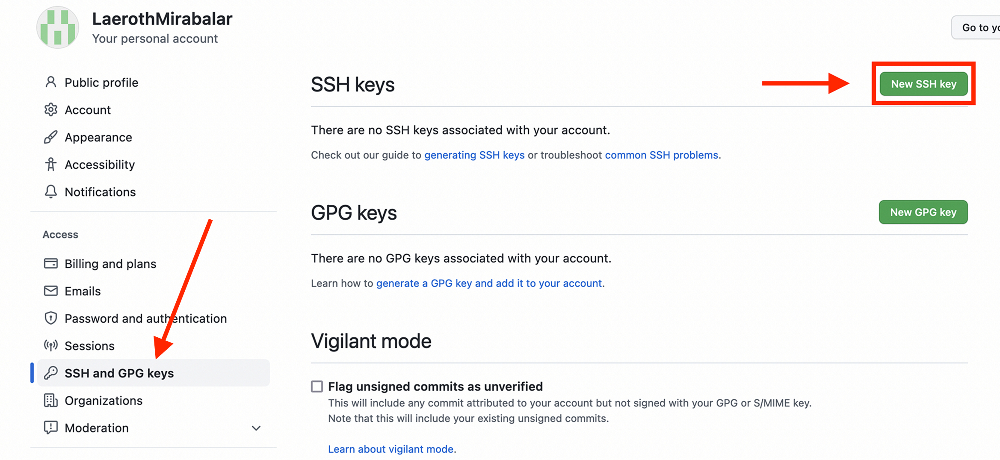
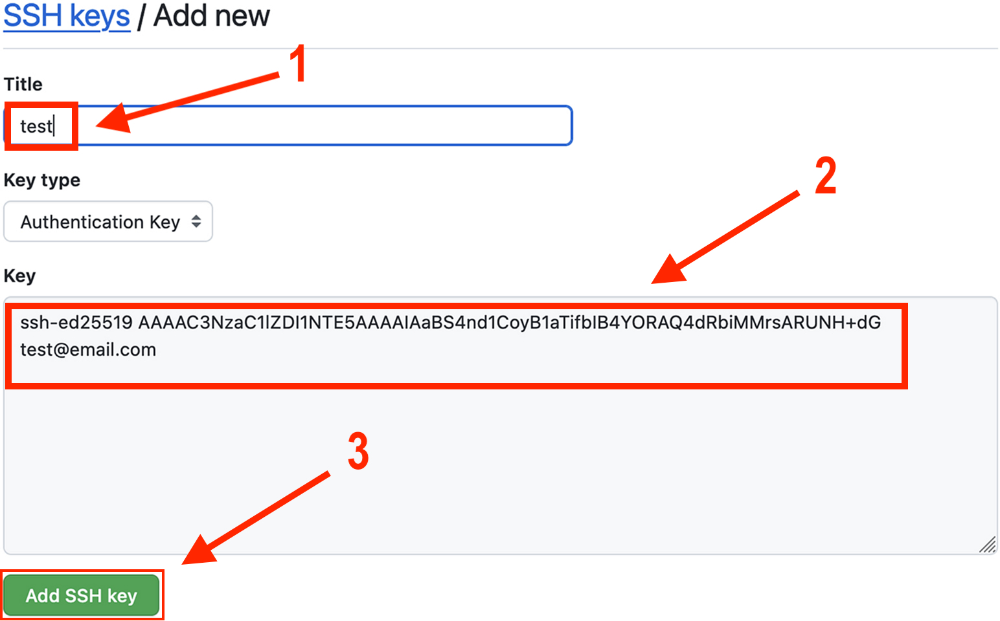
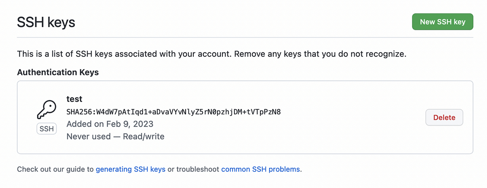

# Setting Up GitHub

Before we can start with step 1, we need to set up our GitHub account. We will need to create an SSH key, which will allow us to connect to GitHub without having to enter our username and password every time.

### Creating a GitHub Account

To complete this tutorial, you will need to create a GitHub account. Follow the "Sign Up" instructions on the official [GitHub website](https://github.com/).

It should look something like this:

<figure markdown>
{ width="300" .card}
<figcaption>GitHub sign-up page</figcaption>
</figure>

If the sign-up was successful, you should see a page that looks like this:

<figure markdown>
{ width="700" .card}
<figcaption>GitHub homepage</figcaption>
</figure>

### Creating an SSH Key

An SSH key is a pair of files that are used to authenticate you when you connect to a remote server. It is a very important tool for developers because it allows you to connect to remote servers without having to enter your username and password every time.

To complete this tutorial, you will need to create an SSH key.

To create an SSH key, we follow the instructions on the official Github website for your operating system [SSH key generation](https://docs.github.com/en/authentication/connecting-to-github-with-ssh/generating-a-new-ssh-key-and-adding-it-to-the-ssh-agent?platform=windows#generating-a-new-ssh-key).

Following these instructions, you will need to run the following command in the terminal:

!!! info "Generating a New SSH Key"

    1. Open the "Git Bash" (Windows) or "Terminal" (Max/Linux) application
    
    2. Run the following command:

        ```bash
        ssh-keygen -t ed25519 -C "your_email@example.com"
        ```
        
    3. Select the default location for the key (default is usually fine)
    
    4. Type a secure passphrase (none is fine for personal use)
    
    5. Copy the key to your clipboard
   
!!! info "Copying the SSH Key to Your Clipboard"
    1. Open the "Git Bash" (Windows) or "Terminal" (Max/Linux) application
    
    2. Run the following command:

        ```bash
        cat ~/.ssh/id_ed25519.pub
        ```
        This will print your key in the terminal window

    3. Copy the key to your clipboard (highlight the key and press `Ctrl + C`)

### Adding the SSH Key to Your GitHub Account

Now that we have created an SSH key, we need to add it to our GitHub account.

We do this by opening the "Settings" page on our GitHub account, and then clicking on the "SSH and GPG keys" tab, then, we click on the "New SSH key" button.

<figure markdown>
{ width="200" .card}
<figcaption>GitHub settings</figcaption>
</figure>

<figure markdown>
{ width="600" .card}
<figcaption>SSH and GPH keys</figcaption>
</figure>

We can then paste our SSH key into the "Key" field, give it a title in the "Title" field, and click "Add SSH Key".

<figure markdown>
{ width="600" .card}
<figcaption>Adding a new SSH key</figcaption>
</figure>

Successfully adding the SSH key should look like this:

<figure markdown>
{ width="600" .card}
<figcaption>SSH key added</figcaption>
</figure>

This means that we have successfully set up our GitHub account, and we can finally create our first repository!

<center>
## You Have Successfully Set Up GitHub! :tada:

[You can now move to the next session](stage_3.md)
</center>