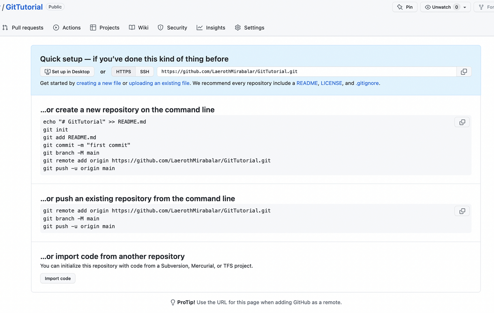

# Our First Repo

## Basic Workflow of Git

Git has a very simple workflow. It is based on the following steps:

!!! note "Advanced Git Workflow"
    1. Create a "repository" (project) with a Git hosting tool (like GitHub)
    2. Copy (or clone) the repository to your local machine
    3. Add a file to your local repo and "commit" (save) the changes
    4. "Push" your changes to your main branch
    5. Make a change to your file with a Git hosting tool and commit
    6. "Pull" the changes to your local machine
    7. ~~Create a "branch" (version), make a change, and commit the change~~
    8. ~~Open a "pull request" (propose changes to the main branch)~~
    9. ~~"Merge" your branch to the main branch~~

As mentioned earlier, we will ignore the last three steps in this tutorial, because they are not necessary for beginners, nor to use Git for small projects.

So, our workflow will be as follows:

!!! note "Simple Git Workflow"
    1. Create a "repository" (project) with a Git hosting tool (like GitHub)
    2. Copy (or clone) the repository to your local machine
    3. "`Add`" a file to your local repo "`commit`" (save) the changes
    4. "`Push`" your changes to your main branch
    5. Make a change to your file with a Git hosting tool and commit
    6. "`Pull`" the changes to your local machine/

## Creating a New 'Repo'

Repo is short for "repository". A repository is a project that is stored in a Git hosting tool (like GitHub). It is a place where you can store your code, and collaborate with others.

### GitHub

We can get started creating a new repository by going to the GitHub home page and clicking the "Create repository" button or the "_+_" (plus) symbol at the top right and then "New repository".

<figure markdown>
{ width="700" .card}
<figcaption>GitHub homepage</figcaption>
</figure>

Doing so will launch a new page where we can create our new repository.

<figure markdown>
{ width="500" .card}
<figcaption>GitHub homepage</figcaption>
</figure>

We can simply give it a name (eg. "Git Tutorial"), leaving all other parameters as default, and click the "Create repository" button.

(The "private/public" option is used to determine whether the repository is public or private. If it is public, anyone can see it. If it is private, only you and the people you invite can see it. We will leave it public for now.)

Doing this will present us with our new repository, ready to be used.

<figure markdown>
{ width="650" .card}
<figcaption>GitHub homepage</figcaption>
</figure>

This page provides us with excellent starting points to start coding in our new repository. We will use these to get started in the next section.

## You Have Successfully Created Your First Repository! :tada:

[You can now move to the next session](stage_4.md)

