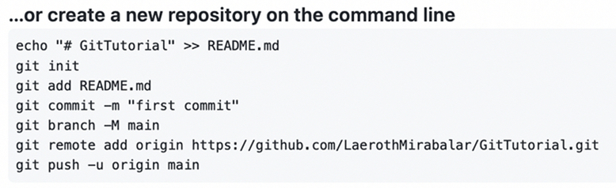

# Cloning The Repository & Staging Area

!!! abstract "Progress"
    In the earlier section, we explained the basic workflow of Git. We will use the table below to keep track of our progress.

    * [x] 1. Create a "repository" (project) with a Git hosting tool (like GitHub)
    * [ ] 2. Copy (or clone) the repository to your local machine
    * [ ] 3. "`Add`" a file to your local repo "`commit`" (save) the changes
    * [ ] 4. "`Push`" your changes to your main branch
    * [ ] 5. Make a change to your file with a Git hosting tool and commit
    * [ ] 6. "`Pull`" the changes to your local machine

## Cloning the Repository

After we created the repo on GitHub, we were left with a page showing us various ways that we could populate our GitHub repo and integrate it with a "local  repo" (one that exists on your machine), out of all of these options, we are interested in the following:

<figure markdown>
{ width="650" .card}
<figcaption>GitHub homepage</figcaption>
</figure>

We will follow these instructions, with some extra guidance.

## Creating a New Directory

To create a new Git repository, you will need to create a new directory (aka a folder) somewhere on your computer. 

Then, you will need to open a terminal window and navigate to that directory:

!!! failure ""
    === "Linux/MacOS"

        This can be done by either right-clicking on the folder and selecting "Open in Terminal" or by running the following command:

        ```bas
        cd /path/to/directory
        ```

    === "Command Prompt"
        [TODO: Check this]
        This can be done by either right-clicking on the folder and selecting "Command Prompt here..." or by running the following command:

        ```
        cd C:\path\to\directory
        ```
    
    === "Git Bash"

        [TODO: Check this]
        This can be done by either right-clicking on the folder and selecting "Git Bash here..." or by running the following command:

        ```
        cd /c/path/to/directory
        ```

        (You can check the current folder path with `pwd`.)

## Initializing the Repository

To initialize a new Git repository, you will need to run the following command:


!!! warning ""
    ```bash
    git init
    ```

This will generate an invisible `.git` folder in your current directory. This folder contains all of the information that Git needs to keep track of your repository.

## Opening the Repository in a Text Editor

We will want to open the folder in your text editor of choice so that we can add some files to it.

If you have an open VS Code window, you can open the folder by using the `File > Open Folder` menu option.

If you are using a different text editor, a similar command should be available. 

## Adding a README.md File

Through our text editor, we will want to create a new file called `README.md`. This is a [Markdown](https://www.markdownguide.org/basic-syntax/) file, which is a simple way to format text. 

The README file is a special file that will contain some information about our project to display on the main page of our GitHub. It is a good idea to include a README file in every project you create, as it will help you and others understand what your project is about.

Once you have created the `README.md ` file, we will just add a single line to it:

!!! warning ""
    ```md
    # My First Repo
    ```

`#` is a Markdown heading, and `My First Repo` is the text that will be displayed.

## Checking Out the Status

Going back to the terminal (if using VS Code, you can open a new terminal inside VS Code by pressing `Ctrl + Shift + ~`), we can run the following command:

!!! warning ""
    ```bash
    git status
    ```

^^Take a moment to read the output of this command.^^

It should look something like this:

!!! warning ""
    ```bash
    On branch main

    No commits yet

    Untracked files:
    (use "git add <file>..." to include in what will be committed)
            README.md

    nothing added to commit but untracked files present (use "git add" to track)
    ```

`git status` is a very useful command, and you will be using it a lot. It will tell you what branch you are on, what files have been changed since your last commit, and more.


This may look a little confusing at first, but it's not hard to understand. Let's try to break it down.

# What Is The Staging Area, Branches, and Commits?


### Untracked Files

Let's take a step back and look at the big picture.
Git is used for keeping track of changes to your files.
However, there are many files that we may wish to ignore, or that we don't want to keep track of (personal files, os files, etc.).

Every time you create a new file, Git doesn't know what it should do with it, this is an `untracked file`.

* `Untracked files`: tells us exactly which files are untracked. That's why we see `README.md` in the list of untracked files.

From here, we can either `add` the file to the `staging area`, or we can ignore it. We will be covering both of these options soon enough. For now, you should know the staging area is a preparatory area for files that are ready to be `committed` (saved).

### Staging Area

Git works by keeping track of changes to your files. When you make a change to a file, Git will notice this change and will ask you if you want to save it. If you do, Git will save a copy of the file in a special "folder" (invisible to the user) called the staging area. 

* `nothing added to commit but untracked files present` is telling us that we have not yet added any files to the staging area.

### Commits

Commits can be thought of as "checkpoints" in your project, similar to a save point in a video game. You can always go back to a previous commit if you need to.

When you are ready to save the changes in your staging area, you will need to `commit` them. This means that Git will take all of the files in the staging area and save them to the repository. 

* `No commits yet` is telling us that we have not yet made any commits to our repository.

### Branches 

Because of this workflow, it's useful to think of a Git repository as a timeline of changes. Every time you make a commit, you are adding a new "event" to the timeline.

Similarly, you can think of a branch as a timeline of commits, of which the `main` branch is the default branch.
In our repository we only have one timeline (aka branch): the `main` branch; but many branches can exist in a single repository. [^1]

[^1]: I know I said I wouldn't go into branches, but this is necessary to understand what's going on here.

(`main` is also sometimes referred to as the `master` branch. This is because the `master` branch was the default branch in Git until recently.)


<center>
## You Have Successfully Cloned Your Repository! :tada:

[You can now move to the next session](stage_5.md)
</center>