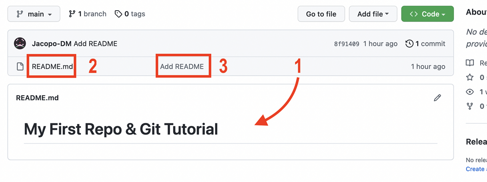

# Our First Commit & Push

!!! abstract "Progress"
    * [x] 1. Create a "repository" (project) with a Git hosting tool (like GitHub)
    * [x] 2. Copy (or clone) the repository to your local machine
    * [ ] 3. "`Add`" a file to your local repo "`commit`" (save) the changes
    * [ ] 4. "`Push`" your changes to your main branch
    * [ ] 5. Make a change to your file with a Git hosting tool and commit
    * [ ] 6. "`Pull`" the changes to your local machine


### Adding a File to the Staging Area: `git add`

We decided we want to add our README file to the staging area, so we can commit it. <br>
We can do this by running the following command:

!!! warning ""
    ```bash
    git add README.md
    ```

!!! tip "`git add .` will add all files in the current directory to the staging area."

If we run `git status` again, we will see that the output has changed:

!!! warning ""
    ```bash
    On branch main

    No commits yet

    Changes to be committed:
    (use "git rm --cached <file>..." to unstage)
            new file:   README.md
    ```

Git is telling us that we have added a new file to the staging area and that we are ready to commit it.

Git will track any changes we make to this file from now on unless we remove it from the staging area with `git rm --cached README.md`.

### Modifying A File in the Staging Area

Before we commit to committing the file (pun intended), let's make a change to the file. <br>
We will add a new line to the README file:

!!! warning ""
    ```md
    # My First Repo & Git Tutorial
    ```

Once again, we will run `git status`:

!!! warning ""
    ```bash
    On branch main

    No commits yet

    Changes to be committed:
    (use "git rm --cached <file>..." to unstage)
            new file:   README.md

    Changes not staged for commit:
    (use "git add <file>..." to update what will be committed)
    (use "git restore <file>..." to discard changes in working directory)
            modified:   README.md
    ```
 
 We have a new message here: `Changes not staged for commit`. This is telling us that we have made changes to a file that is already in the staging area but we have not yet added those changes to the staging area.

To add the changes to the staging area, we can run `git add README.md` again. Alternatively, we can run `git restore README.md` to discard the changes we made to the file.

!!! tip "`add -u` will add all changes to the staging area."

Doing so will change the output of `git status` to the previous output.

### Committing a File: `git commit`

Finally, we decided that the file(s) in our staging area are ready to be committed. <br>
We can do this by running the following command:

!!! warning ""
    ```bash
    git commit -m "Add README"
    ```

This should output the following:

!!! warning ""
    ```bash
    [main (root-commit) 8f91409] Add README
     1 file changed, 1 insertion(+)
     create mode 100644 README.md    
    ```
If you omit the `-m` option, your terminal screen will change and you will be prompted to enter a commit message in your default text editor. This is useful if you want to write a longer commit message.

!!! note "Commit Messages"
    When you make a commit, you will need to provide a commit message. This is a short message that describes the changes you made in this commit. It is a good idea to write a meaningful commit message, as it will help you and others understand what changes were made in this commit. This is especially useful if you're trying to a specific change in the future.

    As seen above this is done by adding `-m "My message"` to the `git commit` command.

If we run `git status` again, we will see that the output has changed:

!!! warning ""
    ```bash
    On branch main
    nothing to commit, working tree clean
    ```

Git is telling us that we have successfully committed our changes to the main branch of our repository.

### Setting the Default Branch

To proceed with our first push, with first have to let Git know where, on GitHub, we want to push our changes to.

To do this, we will need to run the following command:

!!! warning ""
    ```bash
    git branch -M main
    ```

Which will set the main branch as the default branch for our repository.

Then we will need to run the following command:

!!! warning ""
    ```bash
    git remote add origin REPOSITORY_URL
    ```

Where `REPOSITORY_URL` is the URL of our repository on GitHub, this tells Git where exactly on GitHub we want to push our changes.

!!! tip "This only has to be done once when the repository is created, Git will remember the default branch for future pushes."

### Our First Push

Finally, we can push our changes to the main branch of our repository. Meaning all of our commits will be saved remotely and viewed on GitHub.

To do this, we will need to run the following command:

!!! warning ""
    ```bash
    git push -u origin main
    ```

This command will push our changes to the main branch of our repository. The `-u` option will set the main branch as the default branch for our repository. This means that we will not need to specify the branch name when we push our changes in the future, meaning we can simply run `git push`.

If we go back to our GitHub repository, we will see some changes:

<figure markdown>
{ width="650" .card}
<figcaption>GitHub homepage</figcaption>
</figure>

Firstly we can see our landing page has changed to show our README file. Secondly, we can see that a file `README.md` has been added to our repository, and lastly, we see that our commit message `Add README` has been added to our commit history.

From this point on, every time you want to save the state of your repository, you will follow this workflow:

1. Make changes to your files and/or add new files.
2. Use `git add .` to add the files to the staging area.
3. Use `git commit -m "MSG"` to commit the changes to the repository.
4. Use `git push` to push the changes to the main branch of your repository.

<center>
## You Have Successfully Made Your First Commit & Push! :tada:

[You can now move to the next session](stage_6.md)
</center>