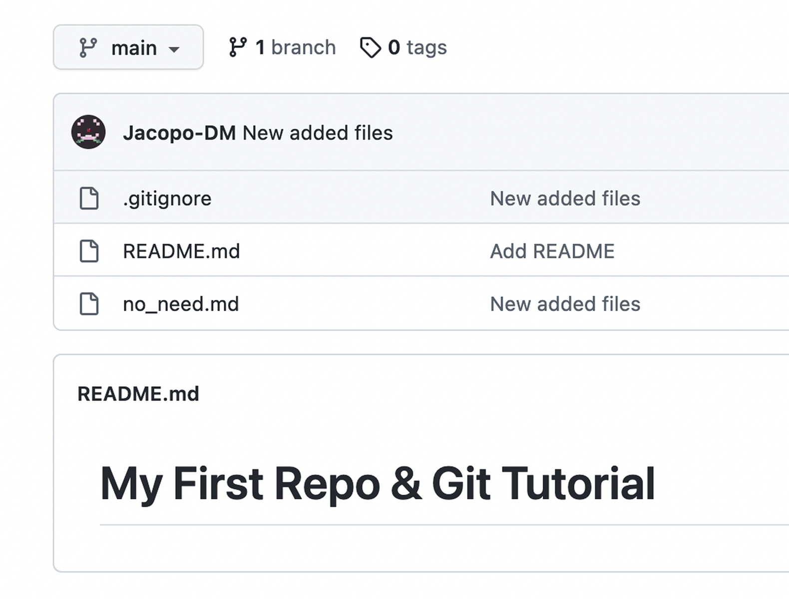

# Ignoring Files & Deleting Files

!!! abstract "Progress"
    * [x] 1. Create a "repository" (project) with a Git hosting tool (like GitHub)
    * [x] 2. Copy (or clone) the repository to your local machine
    * [x] 3. "`Add`" a file to your local repo "`commit`" (save) the changes
    * [x] 4. "`Push`" your changes to your main branch
    * [ ] 5. Make a change to your file with a Git hosting tool and commit
    * [ ] 6. "`Pull`" the changes to your local machine

In some cases, we will want to ignore certain files. For example, we may want to ignore files that are specific to our operating system, files that are specific to our text editor, or private information. We can do this by creating a file called `.gitignore`. This file will tell Git to ignore certain files.

In other cases, we may want to delete files that we previously added but no longer want to keep track of. 

## Creating New Files

Let's make two new files, `no_need.md` and `private_data.md`. We will use these files to demonstrate how to ignore files and how to delete files. As such, they can remain empty.

With `git status` we see:

!!! warning ""
    ```bash
    On branch main
    Your branch is up to date with 'origin/main'.

    Untracked files:
    (use "git add <file>..." to include in what will be committed)
            no_need.md
            private_data.md

    nothing added to commit but untracked files present (use "git add" to track)
    ```

### Adding a `.gitignore` File

We decide we want to keep the `private_data.md` file to ourselves, and we wish for Git to ignore it.
The first step is to create a new file called `.gitignore` and add the following line to it:

!!! warning ""
    ```bash
    private_data.md
    ```

If we run `git status` again, we see:

!!! warning ""
    ```bash
    On branch main
    Your branch is up to date with 'origin/main'.

    Untracked files:
    (use "git add <file>..." to include in what will be committed)
            .gitignore
            no_need.md

    nothing added to commit but untracked files present (use "git add" to track)
    ```

The file disappears from the list of untracked files, and Git is now ignoring it.
We can see that Git is now ignoring the `no_need.md` file, but it is still tracking the `private_data.md` file.

We can add all the names of the files we don't want to track in the `.gitignore` file, one per line. 

!!! tip "Ignoring Files of a Certain Type" 
    It may become tedious to add all the files we don't want to track to the `.gitignore` file. Fortunately, Git allows us to ignore files of a certain type. For example, if we want to ignore all files with a certain extension, we can use the following syntax `*.extension`; for example, if we want to ignore all JPG images we can use `*.jpg`.

!!! tip "Ignoring Files in a Certain Directory"
    Similarly, if we want to ignore all files in a certain directory, we can use the following syntax `directory_name/*`; for example, if we want to ignore all files in a directory called `images`, we can use `images/*` or `images/`.

!!! tip "Virtualenv"
    If you want to use a Virtualenv, this is the time and place to do it, this is because you won't want to track your Virtualenv files in your repository.
    
    You can create a new Virtualenv by running the following command:

    === "Linux/MacOS"

        ```bash
        python3 -m venv env
        ```
    
    === "Windows"

        ```bash
        py -m venv env
        ```

    For more information see the [Virtualenv section in "Getting Started"](../get_started/index.md#virtualenv).

    After you have created your Virtualenv, you can add the following line to your `.gitignore` file:

    ```bash
    env/
    ```

As we've done before, we add these new files to the tracking system with `git add .`, we commit the changes with `git commit -m "Added new files"`, and we push the changes to the remote repository with `git push`.

Our repo should now look like this:

<figure markdown>
{ width="650" .card}
</figure>

### File Deletions

Now, we decide we want to delete the `no_need.md` file, because we no longer need it. 

We can do this by any normal means, such as deleting the file in our text editor, via a file explorer or by running the following command:

!!! warning ""
    ```bash
    rm no_need.md
    ```

Now, if we run `git status` we see:

!!! warning ""
    ```bash
    On branch main

    Changes not staged for commit:
    (use "git add <file>..." to update what will be committed)
    (use "git restore <file>..." to discard changes in working directory)
            deleted:    no_need.md
    ```

We see that Git is aware that we have deleted the `no_need.md` file, but it is not yet aware that we want to delete it from the repository. We can do this by running `git add -u` or `git rm no_need.md`. 

!!! tip "Restoring Files"
    If accidentally deleted a file, you can use `git restore --staged <file>` to unstage the deletion. 

    If you accidentally ran `git rm <file>`, you can use `git restore <file>` to restore the file.)


!!! tip "`add -u` will add all changes to the staging area, including deletions. If you want to add all changes except deletions, you can run `git add -A`."

A `git status` now shows:

!!! warning ""
    ```bash
    On branch main

    Changes to be committed:
    (use "git restore --staged <file>..." to unstage)
            deleted:    no_need.md
    ```

We can now commit the changes with `git commit -m "Deleted no_need.md"`, and push the changes to the remote repository with `git push`.

Our repo should now look like this:

<figure markdown>
{ width="650" .card}
</figure>

!!! warning "Deleted Files Are Still In Your History"
    When you delete a file and commit the change, the file will still be in your previous commits, in the history of your repository. It will just be deleted in your current commit. If you want to completely remove a file from the history of your repository, you will need to use a tool like [BFG Repo-Cleaner](https://rtyley.github.io/bfg-repo-cleaner/).

    Because Git is designed to keep track of changing files, removing those tracks and undoing the history itself is far more complicated than what we are doing here, and is beyond the scope of this tutorial.


<center>
## You Have Successfully Ignored & Deleted Files From Git! :tada:

[You can now move to the next session](stage_7.md)
</center>