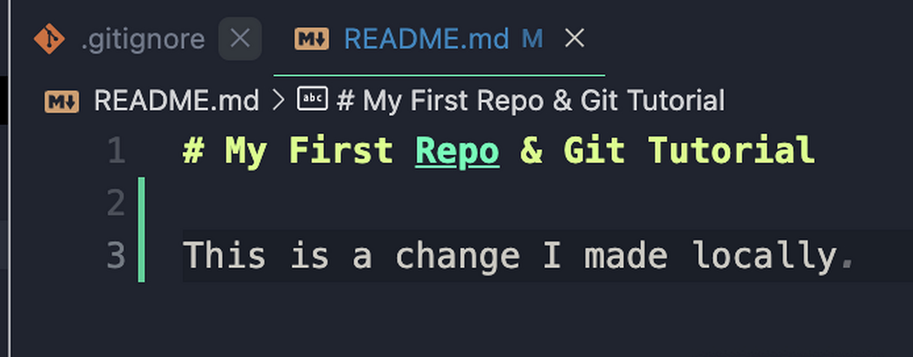

# Remote Changes To Your Repository

!!! abstract "Progress"
    * [x] 1. Create a "repository" (project) with a Git hosting tool (like GitHub)
    * [x] 2. Copy (or clone) the repository to your local machine
    * [x] 3. "`Add`" a file to your local repo "`commit`" (save) the changes
    * [x] 4. "`Push`" your changes to your main branch
    * [ ] 5. Make a change to your file with a Git hosting tool and commit
    * [ ] 6. "`Pull`" the changes to your local machine

We have now explored all the basic ways to interact with a Git repository. Now we want to explore two more ways to interact with a Git repository: 

1. Making changes to a file remotely 
2. Pulling those changes to your local machine.

## Making Changes to a File Remotely

We have already seen how to make changes to a file locally. Now we want to see how to make changes to a file remotely. This could be done by someone else on your team, or by yourself on another machine. 

Since we don't have a team or another machine, we will make the changes to the file ourselves on GitHub itself, which is basically a remote machine.

### Making Changes to a File Remotely on GitHub

1. Go to your repository on GitHub.
2. Click on the `README.md` file.

From here you want to click the edit item (the pencil icon) in the top right corner of the file, as shown below:

<figure markdown>
{ width="650" .card}
</figure>

This will open the file in edit mode. Let's make a change to the file.

First, we will add a new line to the file that says "This is a change I made remotely":

<figure markdown>
{ width="550" .card}
</figure>

We note that (arrow "2") GitHub has already added a commit message for us. The default commit message is "Update README.md". This is a good commit message, so we will leave it as is.

It also specifies that it will be committed to the "main" branch. This is also correct, so we will leave it as is.

Next, we will click the green "Commit changes" button at the bottom of the page (arrow "3").

If we go back to the main page of our repository, we will see that the file has been updated with the commit message `Update README.md`.

!!! warning "Easy vs Advanced"

    In the following section, we will be pulling the remote changes to our local machine. This section will be split into two parts: "Easy" and "Advanced". 

    The "Easy" section will contain a straightforward explanation of how to pull the changes to your local machine.
    In the "Advanced" section we will explore the idea of `merge conflicts`, which happen when two code updates are overlapping, and how to resolve them.

    You should read through both sections, and choose the one that is most appropriate for you.

=== "Easy :cake:"
    ## Pulling Changes to Your Local Machine (Easy)

    Now that we have made a change to the file remotely, we want to `pull` those changes to our local machine. Pull is the Git term equivalent to "download updates".

    This is a very simple process. All we need to do is run the following command in our terminal:

    !!! warning ""
        ```bash
        git pull
        ```
    
    This will return a message explaining what changes, and of how many bits, the pull operation per the changes from the remote repository to our local machine.

    If we open the `README.md` file in our text editor, we will see that the file has been updated with the new line we added remotely.

    !!! warning ""
        ```markdown
        # My First Repo & Git Tutorial

        This is a change I made remotely
        ```

    Congratulations! You have successfully pulled changes from a remote repository to your local machine.

=== "Advanced :hot_pepper:"
    ## Pulling Changes to Your Local Machine (Advanced)

    Now that we have made a change to the file remotely, we want to `pull` those changes to our local machine. Pull is the Git term equivalent to "download updates".

    ### Making Some Changes Locally

    Before we pull the changes, let's make some changes to the file locally. This will allow us to see how Git handles conflicts. Conflicts also called `merge conflicts`, occur when Git cannot automatically merge two changes to the same file. These conflicts occur when you, or a team member, make changes to the same file in the same branch in between pushes. These conflicts must be resolved manually.

    1. Open the `README.md` file in your text editor.
    2. Add a new line to the file that says "This is a change I made locally".

    <figure markdown>
    { width="500" .card}
    </figure>

    ### Attempting to Pull the Changes

    Let's try our usual workflow of `add`, `commit`, and `push`, on the last we get an unexpected result.

    !!! warning ""
        ```bash
        To github.com:Jacopo-DM/ProjectMinecraft.git
        ! [rejected]        main -> main (fetch first)
        error: failed to push some refs to 'github.com:Jacopo-DM/ProjectMinecraft.git'
        hint: Updates were rejected because the remote contains work that you do
        hint: not have locally. This is usually caused by another repository pushing
        hint: to the same ref. You may want to first integrate the remote changes
        hint: (e.g., 'git pull ...') before pushing again.
        hint: See the 'Note about fast-forwards' in 'git push --help' for details.
        ```

    Git is telling us that we need to `pull` the changes before we can `push` our changes. Let's do that.

    !!! warning ""
        ```bash
        git pull
        ```

    The output now is even more obscure:

    !!! warning ""
        ```bash
        remote: Enumerating objects: 5, done.
        remote: Counting objects: 100% (5/5), done.
        remote: Compressing objects: 100% (3/3), done.
        Unpacking objects: 100% (3/3), 719 bytes | 359.00 KiB/s, done.
        remote: Total 3 (delta 0), reused 0 (delta 0), pack-reused 0
        From github.com:Jacopo-DM/ProjectMinecraft
        4f0bc51..c94a01e  main       -> origin/main
        hint: You have divergent branches and need to specify how to reconcile them.
        hint: You can do so by running one of the following commands sometime before
        hint: your next pull:
        hint: 
        hint:   git config pull.rebase false  # merge
        hint:   git config pull.rebase true   # rebase
        hint:   git config pull.ff only       # fast-forward only
        hint: 
        hint: You can replace "git config" with "git config --global" to set a default
        hint: preference for all repositories. You can also pass --rebase, --no-rebase,
        hint: or --ff-only on the command line to override the configured default per
        hint: invocation.
        fatal: Need to specify how to reconcile divergent branches.
        ```

    Thankfully, Git is giving us some helpful hints. It is telling us that we need to specify how to reconcile the divergent branches. We can do this by running one of the following commands:

    !!! warning ""
        ```bash
        git config pull.rebase false  # merge
        git config pull.rebase true   # rebase
        git config pull.ff only       # fast-forward only
        ```

    These are the three different ways that Git can handle divergent branches. The intricacies of this are too complex to go into here. For now, we will use the default option, which is to merge the branches. We can do this by running the following command:

    !!! warning ""
        ```bash
        git config pull.rebase false
        ```
        
    !!! info "More Information"
        More information on this for those interested:

        * [Git Merging vs. Rebasing](https://spin.atomicobject.com/2019/01/10/git-merging-vs-rebasing/)
        * [Git Merge vs Rebase](https://itnext.io/git-merge-vs-rebase-938950fb218)
        * [Git - When to Merge vs. When to Rebase](https://www.derekgourlay.com/blog/git-when-to-merge-vs-when-to-rebase/)
        * [Git tips](https://medium.com/@mvuksano/git-tips-use-only-fast-forward-merges-with-rebase-c80c9d260a83)

    Now that we have specified how to reconcile the divergent branches, we can try to `push` again.

    Now we get a new error:

    !!! warning ""
        ```bash
        Auto-merging README.md
        CONFLICT (content): Merge conflict in README.md
        Automatic merge failed; fix conflicts and then commit the result.
        ```

    Git is telling us that there is a conflict. This is happening because we wrote a new line to the file locally, but someone else (us on GitHub) wrote something else on the same line remotely.

    We need to resolve this conflict before we can `push` our changes. Let's do that.

    ### Resolving a Conflict

    Once again `git status` comes to the rescue:

    !!! warning ""
        ```bash
        On branch main
        Your branch and 'origin/main' have diverged,
        and have 1 and 1 different commits each, respectively.
        (use "git pull" to merge the remote branch into yours)

        You have unmerged paths.
        (fix conflicts and run "git commit")
        (use "git merge --abort" to abort the merge)

        Unmerged paths:
        (use "git add <file>..." to mark resolution)
                both modified:   README.md

        no changes added to commit (use "git add" and/or "git commit -a")
        ```

    From this, we can see that the file that is causing the conflict is `README.md`.
    We knew this, but in a larger project, it would be helpful to know which file is causing the conflict.

    If we reopen `README.md` in our editor, we can see the conflict:

    !!! warning ""
        ```markdown
        <<<<<<< HEAD
        This is a change I made locally
        =======
        This is a change I made remotely
        >>>>>>> c94a01eefa115528633a213491fc64ccb0fdb66a
        ```

    If you're using visual studio code, you can have a nice diff view of the conflict:

    <figure markdown>
    { width="600" .card}
    </figure>

    The most sensible thing to do here is to keep both changes. We can do this by deleting the conflict markers and keeping both lines:

    !!! warning ""
        ```markdown
        This is a change I made locally

        This is a change I made remotely
        ```

    or is VS Code: 

    <figure markdown>
    { width="600" .card}
    </figure>

    Now that we have resolved the conflict, we can `add` and `commit` the changes:

    !!! warning ""
        ```bash
        git add README.md
        git commit -m "Resolved conflict"
        ```

    Git status now tells us that we are ready to `push`:

    !!! warning ""
        ```bash
        On branch main
        Your branch is ahead of 'origin/main' by 2 commits.
        (use "git push" to publish your local commits)

        nothing to commit, working tree clean
        ```

    We can finally `push` our changes:

    !!! warning ""
        ```bash
        git push
        ```

    Now if we go back to GitHub, we can see that our changes have been pushed:

    <figure markdown>
    { width="600" .card}
    </figure>

    Congratulations! You have successfully pulled changes from a remote repository to your local machine AND resolved a conflict!

You can view a hisitory of all the commits in your repository by clicking on the "insights" tab followed by "network":

<figure markdown>
{ width="600" .card}
</figure>

!!! abstract "Progress"
    * [x] 1. Create a "repository" (project) with a Git hosting tool (like GitHub)
    * [x] 2. Copy (or clone) the repository to your local machine
    * [x] 3. "`Add`" a file to your local repo "`commit`" (save) the changes
    * [x] 4. "`Push`" your changes to your main branch
    * [x] 5. Make a change to your file with a Git hosting tool and commit
    * [x] 6. "`Pull`" the changes to your local machine

<center>
## You Have Successfully Finish The First Part of This Tutorial! :fireworks:

[It's time to choose a project](../project/index.md)
</center>